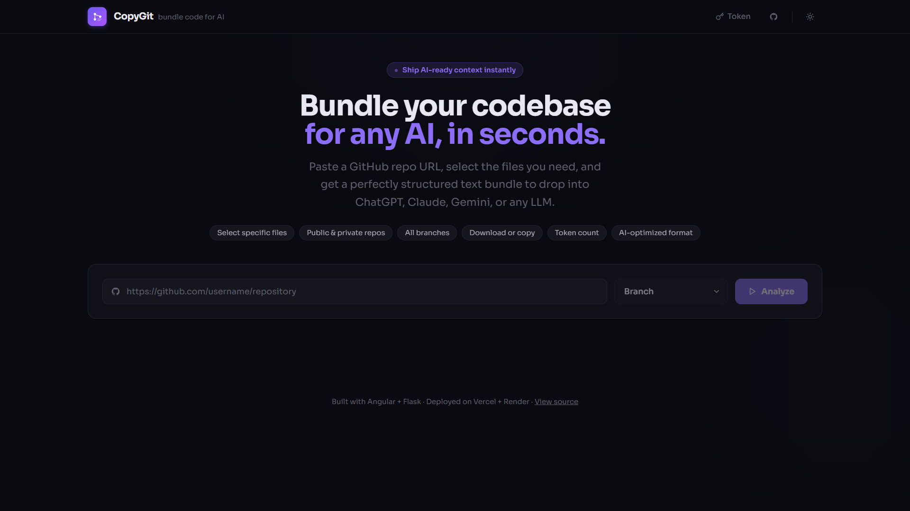
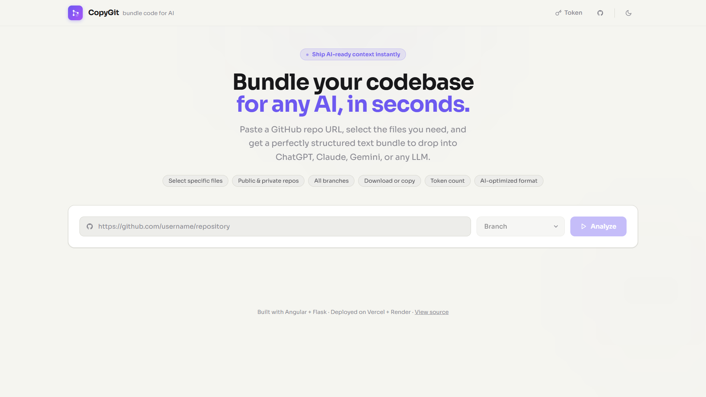
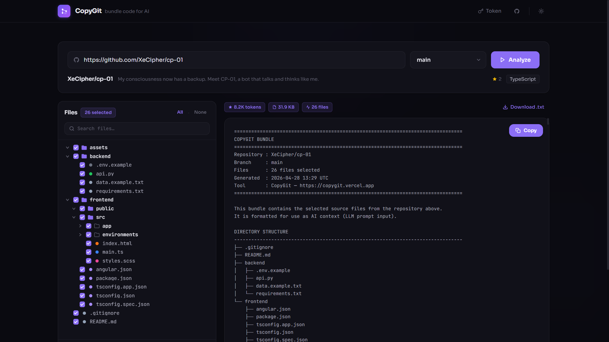
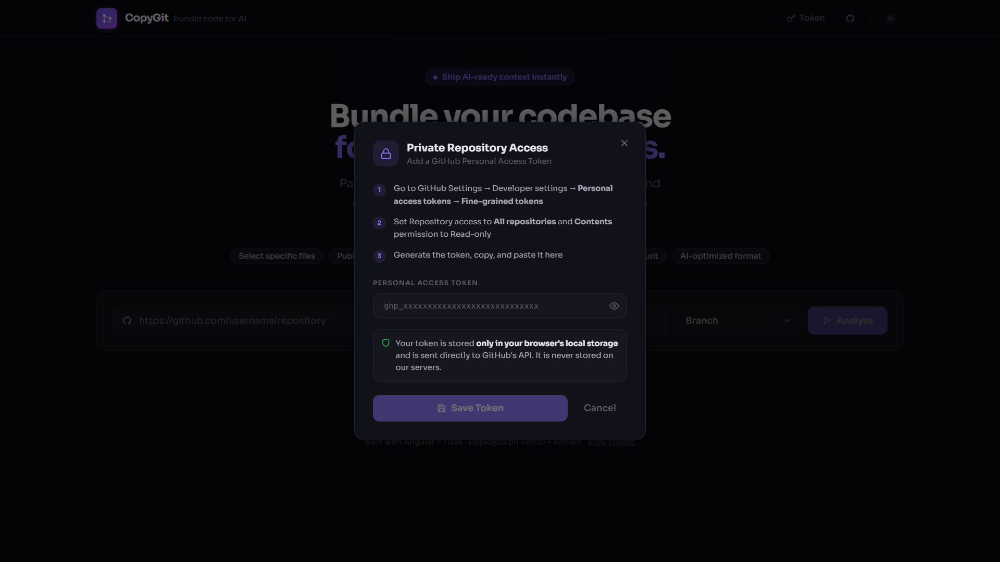

# CopyGit

<div align="center">

**Bundle your GitHub codebase for any AI, in seconds.**

Paste a GitHub repo URL, select the files you need, and get a perfectly structured text bundle to drop into ChatGPT, Claude, Gemini, or any LLM.

[](https://copygit.vercel.app/)
[](https://github.com/XeCipher/CopyGit)

</div>

---

## Screenshots

### Hero Page

| Dark Mode | Light Mode |
|---|---|
|  |  |

### Analyzing a Repository



### Private Repository Access (Token Modal)



---

## What It Does

A developer pastes any GitHub repository URL into CopyGit. The system automatically:

1. Fetches repository metadata and all available branches
2. Clones the repo and renders an interactive file tree
3. Lets you select exactly which files to include
4. Generates a structured plain-text bundle formatted for LLM context windows
5. Displays token count, file size, and file count estimates
6. Lets you copy the bundle to clipboard or download it as a `.txt` file

Private repositories are fully supported via a GitHub Personal Access Token, stored only in your browser.

---

## Tech Stack

| Layer | Technology |
|---|---|
| Frontend | Angular 19, TypeScript, Tailwind CSS |
| Backend | Python, Flask, Flask-CORS |
| Git | GitPython |
| Hosting | Vercel (Frontend), Render (Backend) |

---

## Core Features

- **File Tree Selection**: Browse the full repository structure and select exactly the files you need
- **Branch Selector**: Switch between any branch before cloning
- **Private Repo Support**: Add a GitHub Personal Access Token to access private repositories
- **Token Count Estimate**: See an approximate LLM token count before you copy
- **Copy and Download**: Copy the bundle to clipboard or download as a `.txt` file
- **AI-Optimised Format**: Output includes a structured header, directory tree, and each file with clear separators
- **Dark and Light Mode**: Theme preference is saved to local storage
- **Error Handling**: Friendly messages for rate limits, invalid tokens, private repos, and network timeouts

---

## Output Format

Every generated bundle follows this structure, designed for clean LLM ingestion:

```
================================================================================
COPYGIT BUNDLE
================================================================================
Repository : owner/repo
Branch     : main
Files      : 12 files selected
Generated  : 2026-04-28 13:06 UTC
Tool       : CopyGit - https://copygit.vercel.app
================================================================================

DIRECTORY STRUCTURE
--------------------------------------------------------------------------------
├── backend
│   └── app.py
└── frontend
    └── src
        └── app
            └── app.component.ts

================================================================================

FILES
================================================================================

FILE: backend/app.py
--------------------------------------------------------------------------------
<file contents>

================================================================================
```

---

## Project Structure

```
CopyGit/
├── backend/
│   ├── app.py               # Flask API: repo info, clone, process, cleanup
│   └── requirements.txt
│
└── frontend/
    ├── angular.json
    ├── tailwind.config.js
    ├── package.json
    └── src/
        ├── index.html
        ├── main.ts
        ├── styles.scss
        └── app/
            ├── app.component.ts       # Main app logic
            ├── app.component.html     # UI template
            ├── app.config.ts
            ├── app.routes.ts
            ├── components/
            │   └── tree-node/
            │       └── tree-node.component.ts   # Recursive file tree
            └── services/
                └── api.service.ts     # HTTP calls to the Flask backend
```

---

## Setup and Installation

### Backend

```bash
cd backend
python -m venv venv
venv\Scripts\activate        # Windows
source venv/bin/activate     # macOS / Linux
pip install -r requirements.txt
python app.py
```

The backend runs on `http://localhost:5000` by default.

### Frontend

```bash
cd frontend
npm install
ng serve
```

Open `http://localhost:4200` in your browser.

The development environment points to `http://localhost:5000/api`. The production build points to `https://copygit.onrender.com/api`.

---

## API Endpoints

| Method | Endpoint | Description |
|---|---|---|
| `POST` | `/api/repo-info` | Fetch repo metadata and branch list from GitHub API |
| `POST` | `/api/analyze` | Clone the repository and return the file tree |
| `POST` | `/api/process` | Read selected files and return the formatted bundle |
| `GET` | `/ping` | Health check |

The temporary clone directory is deleted automatically after `/api/process` completes, whether the request succeeds or fails.

---

## Private Repository Access

CopyGit supports private GitHub repositories via a Personal Access Token.

1. Go to GitHub Settings → Developer settings → Personal access tokens → Fine-grained tokens
2. Set Repository access to **All repositories** and **Contents** permission to **Read-only**
3. Generate the token, copy it, and paste it into CopyGit using the **Token** button

Your token is stored only in your browser's local storage. It is never sent to or stored on CopyGit's servers. It is passed directly from your browser to the GitHub API for authentication.

---

## Ignored Files

The backend automatically excludes the following from the file tree and output bundle:

- Directories: `.git`, `node_modules`, `venv`, `__pycache__`, `dist`, `build`, `.angular`, `.next`, `coverage`, `tmp`, `temp`
- Extensions: images, fonts, binaries, compiled files (`.png`, `.jpg`, `.pdf`, `.zip`, `.pyc`, `.class`, `.dll`, and more)
- Lock files: `package-lock.json`, `yarn.lock`

---

## Deployment

| Service | Platform | Notes |
|---|---|---|
| Frontend | Vercel | Auto-deploys from `main` branch |
| Backend | Render | Free tier; may have cold start delay on first request |

---

## Usage

1. Go to [copygit.vercel.app](https://copygit.vercel.app/)
2. Paste a GitHub repository URL
3. Select a branch from the dropdown (auto-populated)
4. Click **Analyze** to clone and load the file tree
5. Check or uncheck files as needed, or use **All** / **None**
6. Click **Generate Bundle**
7. Click **Copy** or **Download .txt**
8. Paste the bundle directly into your AI assistant of choice