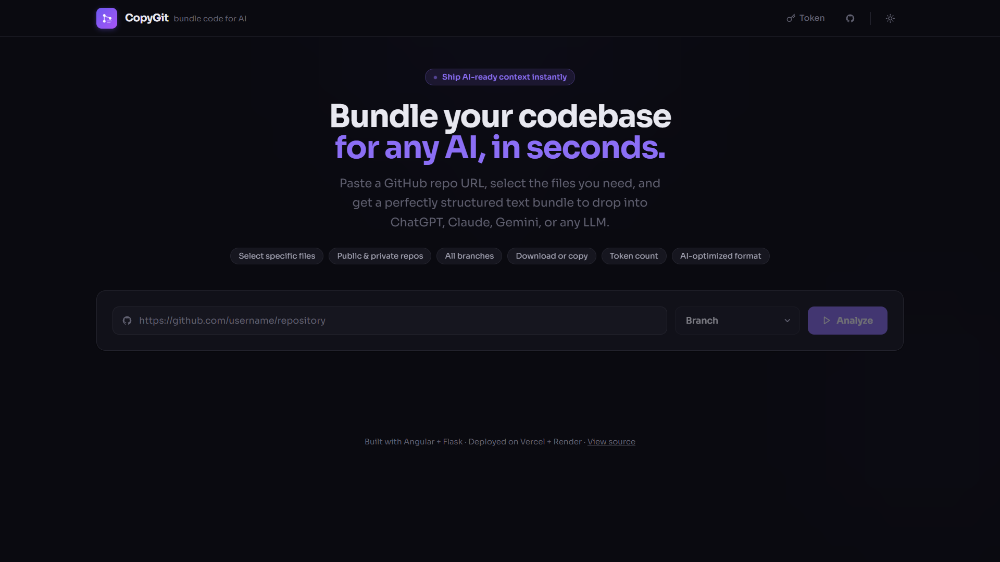
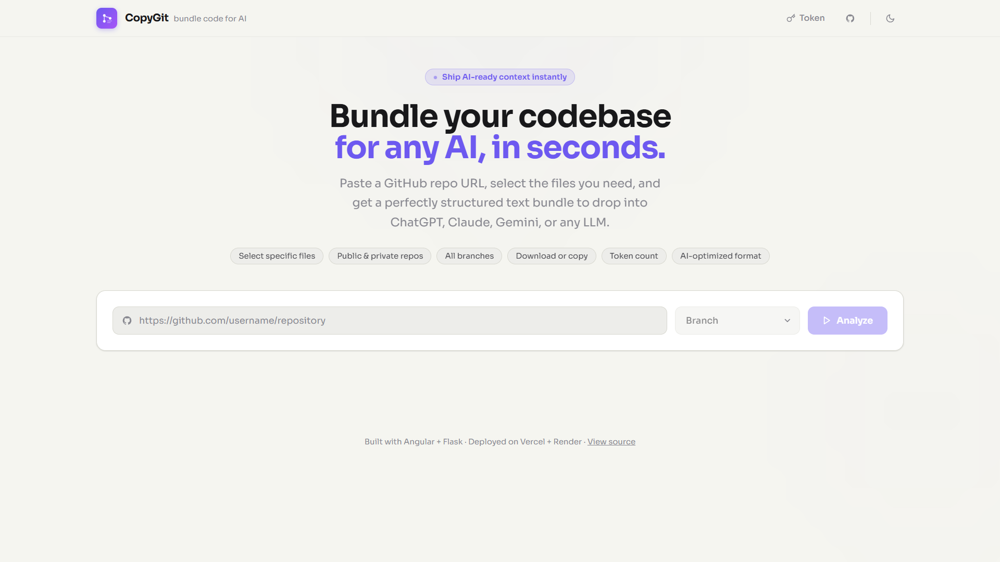
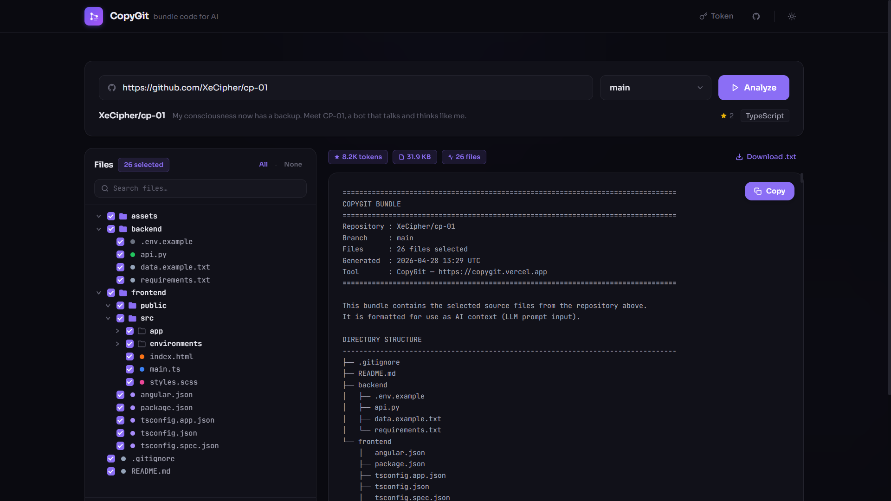
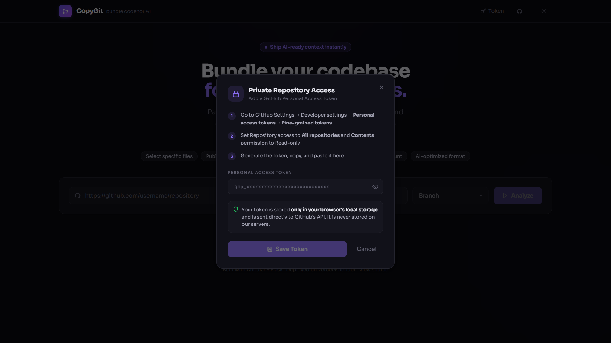

# CopyGit

<div align="center">

**Bundle your GitHub codebase for any AI, in seconds.**

Paste a GitHub repo URL, select the files you need, and get a perfectly structured text bundle to drop into ChatGPT, Claude, Gemini, or any LLM.

[](https://copygit.vercel.app/)
[](https://github.com/XeCipher/CopyGit)

</div>

---

## Screenshots

### Hero Page

| Dark Mode | Light Mode |
|---|---|
|  |  |

### Analyzing a Repository



### Private Repository Access (Token Modal)



---

## What It Does

A developer pastes any GitHub repository URL into CopyGit. The system automatically:

1. Fetches repository metadata and all available branches via the GitHub API
2. Renders an interactive file tree using GitHub's Git Trees API, no cloning required
3. Lets you select exactly which files to include
4. Downloads a repository tarball in-memory and extracts only the selected files
5. Generates a structured plain-text bundle formatted for LLM context windows
6. Displays token count, file size, and file count estimates
7. Lets you copy the bundle to clipboard or download it as a `.txt` file

Private repositories are fully supported via a GitHub Personal Access Token, stored only in your browser.

---

## Architecture

CopyGit is fully serverless. There is no persistent backend, everything runs as **Vercel Serverless Functions** (Node.js).

```
Browser → Vercel Edge
              ├── /api/repo-info   → GitHub REST API (repo metadata + branches)
              ├── /api/analyze     → GitHub Git Trees API (recursive file tree)
              └── /api/process     → GitHub Tarball API → in-memory tar extraction
```

**Key design decisions:**

- **No cloning.** The file tree is built from GitHub's `/git/trees` endpoint with `recursive=1`. No `git clone`, no disk I/O.
- **Stateless extraction.** On bundle generation, the repository tarball is streamed directly from GitHub, gunzipped and parsed in-memory using `tar-stream`. Only selected files are extracted; nothing is written to disk.
- **No temp storage.** Every request is independent. There are no temporary directories, no cleanup jobs, and no session state.

---

## Tech Stack

| Layer | Technology |
|---|---|
| Frontend | Angular 19, TypeScript, Tailwind CSS |
| API | Vercel Serverless Functions (Node.js) |
| Streaming | `tar-stream`, Node.js `zlib` |
| Hosting | Vercel (frontend + API, single deployment) |

---

## Core Features

- **File Tree Selection** - Browse the full repository structure and select exactly the files you need
- **Branch Selector** - Switch between any branch before analyzing
- **Private Repo Support** - Add a GitHub Personal Access Token to access private repositories
- **Token Count Estimate** - See an approximate LLM token count before you copy
- **Copy and Download** - Copy the bundle to clipboard or download as a `.txt` file
- **AI-Optimised Format** - Output includes a structured header, directory tree, and each file with clear separators
- **Dark and Light Mode** - Theme preference is saved to local storage
- **Error Handling** - Friendly messages for rate limits, invalid tokens, private repos, and network errors

---

## Output Format

Every generated bundle follows this structure, designed for clean LLM ingestion:

```
================================================================================
COPYGIT BUNDLE
================================================================================
Repository : owner/repo
Branch     : main
Files      : 12 files selected
Generated  : 2026-04-28 13:06 UTC
Tool       : CopyGit - https://copygit.vercel.app
================================================================================

DIRECTORY STRUCTURE
--------------------------------------------------------------------------------
├── frontend
│   └── src
│       └── app
│           └── app.component.ts

================================================================================

FILES
================================================================================

FILE: frontend/src/app/app.component.ts
--------------------------------------------------------------------------------
<file contents>

================================================================================
```

---

## Project Structure

```
CopyGit/
├── frontend/
│   ├── api/
│   │   ├── repo-info.js       # Serverless: repo metadata + branch list
│   │   ├── analyze.js         # Serverless: file tree via Git Trees API
│   │   └── process.js         # Serverless: tarball stream + in-memory extraction
│   ├── angular.json
│   ├── tailwind.config.js
│   ├── package.json
│   └── src/
│       ├── index.html
│       ├── main.ts
│       ├── styles.scss
│       └── app/
│           ├── app.component.ts       # Main app logic
│           ├── app.component.html     # UI template
│           ├── app.config.ts
│           ├── components/
│           │   └── tree-node/
│           │       └── tree-node.component.ts   # Recursive file tree
│           └── services/
│               └── api.service.ts     # HTTP calls to serverless API routes
```

---

## Setup and Installation

### Prerequisites

- Node.js 18+
- Angular CLI (`npm install -g @angular/cli`)

### Local Development

```bash
cd frontend
npm install
ng serve
```

Open `http://localhost:4200` in your browser.

The `/api/*` routes are served locally via the Vercel CLI or proxied through Angular's dev server. For local API testing, install the Vercel CLI:

```bash
npm install -g vercel
vercel dev
```

This starts both the Angular frontend and the serverless functions on a single local port.

---

## API Endpoints

All endpoints are Vercel Serverless Functions under `frontend/api/`.

| Method | Endpoint | Description |
|---|---|---|
| `POST` | `/api/repo-info` | Fetch repo metadata and branch list from GitHub API |
| `POST` | `/api/analyze` | Build file tree using GitHub's Git Trees API (no cloning) |
| `POST` | `/api/process` | Stream and extract selected files from GitHub tarball in-memory |

### Request Shapes

**`/api/repo-info`**
```json
{ "url": "https://github.com/owner/repo", "token": "ghp_..." }
```

**`/api/analyze`**
```json
{ "url": "https://github.com/owner/repo", "branch": "main", "token": "ghp_..." }
```

**`/api/process`**
```json
{
  "files": ["src/app/app.component.ts", "src/main.ts"],
  "repo_name": "repo",
  "branch": "main",
  "owner": "owner",
  "token": "ghp_..."
}
```

---

## Environment Variables

Set the following in your Vercel project settings or a local `.env` file:

| Variable | Description |
|---|---|
| `GITHUB_BACKEND_TOKEN` | (Optional) A server-side GitHub token used as a fallback when the user has not provided their own. Raises the API rate limit from 60 to 5,000 requests/hour. |

---

## Private Repository Access

CopyGit supports private GitHub repositories via a Personal Access Token.

1. Open [GitHub Token Settings](https://github.com/settings/personal-access-tokens/new) to create a new **Fine-grained token**.
2. Set *Repository access* to **All repositories**. Then, under *Repository permissions*, set **Contents** to **Read-only**.
3. Click **Generate token** at the bottom, then copy and paste it into the CopyGit Token modal.

Your token is stored only in your browser's local storage and is sent directly to GitHub's API. It is never stored on any server.

---

## Ignored Files

The `/api/analyze` function automatically excludes the following from the file tree:

**Directories:** `.git`, `.github`, `node_modules`, `venv`, `__pycache__`, `.next`, `dist`, `build`, `.angular`, `.vscode`, `coverage`, `tmp`, `temp`

**Extensions:** images, fonts, binaries, compiled files (`.png`, `.jpg`, `.gif`, `.svg`, `.ico`, `.pdf`, `.zip`, `.pyc`, `.class`, `.dll`, `.so`, `.rvt`, and more)

**Lock files:** `package-lock.json`, `yarn.lock`

---

## Deployment

The entire application: frontend and API, deploys as a **single Vercel project**.

| Component | Platform | Notes |
|---|---|---|
| Angular Frontend | Vercel | Auto-deploys from `main` branch |
| Serverless API (`/api/*`) | Vercel Functions | Co-deployed with the frontend, no separate service |

There is no external backend. No cold starts from a separate host.

---

## Usage

1. Go to [copygit.vercel.app](https://copygit.vercel.app/)
2. Paste a GitHub repository URL
3. Select a branch from the dropdown (auto-populated)
4. Click **Analyze** to load the file tree
5. Check or uncheck files as needed, or use **All** / **None**
6. Click **Generate Bundle**
7. Click **Copy** or **Download .txt**
8. Paste the bundle directly into your AI assistant of choice
